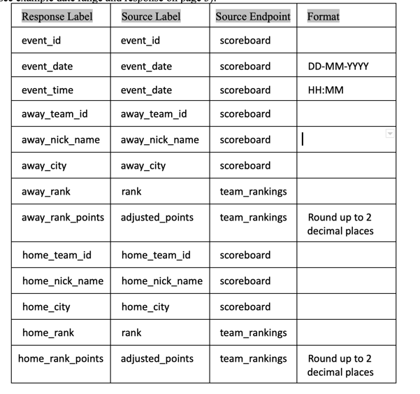

# ACME-Sports

This project is a simple command line program written in `Python 3.X` that fetches and parses data from 2 API endpoints,
merges the data and returns a json formatted string.


## Dependency installation

It's recommended to use a [Python virtual env](https://docs.python.org/3.8/tutorial/venv.html) as this prevents any issues with the global Python installation on your machine. 

Once your python virtual env is installed and sourced, please run the following to install any dependencies. 

```bash
pip install -r requirements.txt 
```

## How to run

You can run this tool via the CLI from the root of the project. 

Help

```bash
./main.py -h                                                                                           
usage: main [-h] -api_key API_KEY -start_date START_DATE -end_date END_DATE [-v]

List NFL data gathered from remote API

optional arguments:
  -h, --help            show this help message and exit
  -api_key API_KEY      API Key used to authenticate to the server
  -start_date START_DATE
                        Start date used to narrow down the scoreboard
  -end_date END_DATE    End date used to narrow down the scoreboard
  -v, -version          show program's version number and exit

```

Run example

```bash
./main.py -api_key=<API_KEY> -start_date=2020-01-12 -end_date=2020-01-19
```

Example output:
```bash
[
    {
        "event_id": "1233827",
        "event_date": "12-01-2020",
        "event_time": "15:05",
        "away_team_id": "42",
        "away_nick_name": "Texans",
        "away_city": "Houston",
        "away_rank": "3",
        "away_rank_points": "19.28",
        "home_team_id": "63",
        "home_nick_name": "Chiefs",
        "home_city": "Kansas City",
        "home_rank": "3",
        "home_rank_points": "19.28"
    },
    {
        "event_id": "1233912",
        "event_date": "12-01-2020",
        "event_time": "18:40",
        "away_team_id": "52",
        "away_nick_name": "Seahawks",
        "away_city": "Seattle",
        "away_rank": "7",
        "away_rank_points": "10.11",
        "home_team_id": "39",
        "home_nick_name": "Packers",
        "home_city": "Green Bay",
        "home_rank": "7",
        "home_rank_points": "10.11"
    },
    {
        "event_id": "1234560",
        "event_date": "19-01-2020",
        "event_time": "15:05",
        "away_team_id": "62",
        "away_nick_name": "Titans",
        "away_city": "Tennessee",
        "away_rank": "3",
        "away_rank_points": "19.28",
        "home_team_id": "63",
        "home_nick_name": "Chiefs",
        "home_city": "Kansas City",
        "home_rank": "3",
        "home_rank_points": "19.28"
    },
    {
        "event_id": "1234565",
        "event_date": "19-01-2020",
        "event_time": "18:40",
        "away_team_id": "39",
        "away_nick_name": "Packers",
        "away_city": "Green Bay",
        "away_rank": "6",
        "away_rank_points": "10.34",
        "home_team_id": "58",
        "home_nick_name": "49ers",
        "home_city": "San Francisco",
        "home_rank": "6",
        "home_rank_points": "10.34"
    }
]


```

## Run Tests

```bash
python -m 'pytest' test_main.py
```


## Libraries 

- pytest
- requests
- argparse
- logging
- json 
- datetime


## Improvements 

- More tests can be written 
- In `parse_team_rankings` and `parse_score_board` methods I am using a nested for loop. This will not scale well. The time complexity is 0(n^2).


## Assumptions 

It seems that either the example response at the end of the `Python Development Challenge ` document is wrong or the table on page 2 is wrong. 

My explanation below:

If we take a look at the first element in the example response: 

```bash
{
"event_id": "1233827",
"event_date": "12-01-2020",
"event_time": "15:05",
"away_team_id": "42",
"away_nick_name": "Texans",
"away_city": "Houston",
"away_rank": "21", <----- Here
"away_rank_points": "-6.00", <----- Here
"home_team_id": "63",
"home_nick_name": "Chiefs",
"home_city": "Kansas City",
"home_rank": "2", <----- Here
"home_rank_points": "21.20" <----- Here
}

```

We can see that `away_rank` is `21` and `home_rank` is `2`. 

However, in the table on page 2 (see below), `away_rank` and `home_rank` are being sourced from the same source label `rank` and from the same source endpoint `/scoreboard`. There is no formatting being asked, so I am just wondering how in the example response these 2 keys differ. 

The same thing can be seen for `home_rank_points` and `away_rank_points`

